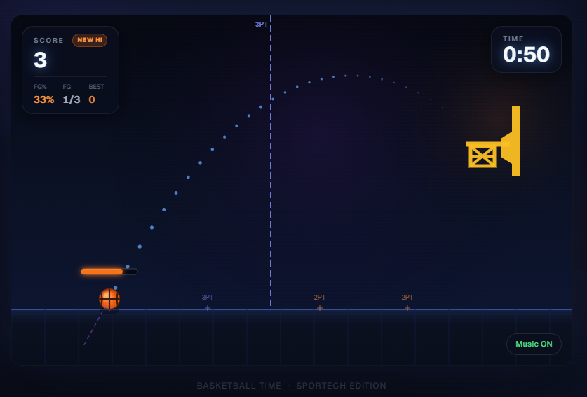
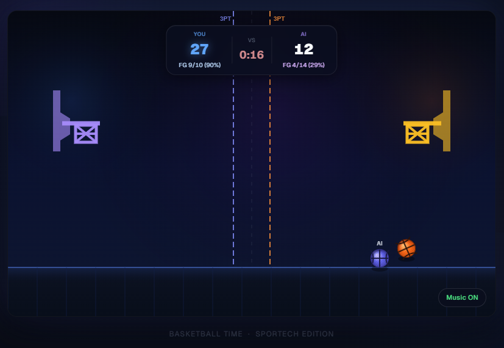

# Mini Basket

Mini Basket is a completed browser basketball shooting game built as a Next.js portfolio project. The game uses a custom canvas renderer, TypeScript game state, projectile physics, scoring, timed rounds, local high scores, and a solo or 1v1 AI mode.

## Screenshots





## Demo

[Play Mini Basket](https://mini-basket-mk.vercel.app/)

## Features

- 90-second timed shooting rounds.
- Solo mode with high score tracking in `localStorage`.
- 1v1 AI mode with mirrored hoops, AI scoring, and overtime on ties.
- Clickable shooting spots with 2-point and 3-point scoring.
- Drag-to-aim shooting with trajectory preview and power feedback.
- Canvas-rendered court, hoops, balls, effects, and HUD overlays.
- Music toggle and shot/miss sound effects loaded from `public/audio`.

## Tech Stack

- Next.js 16 App Router
- React 19
- TypeScript
- Tailwind CSS 4
- HTML Canvas 2D rendering
- Vercel Analytics
- Radix UI / shadcn-style component primitives present in `components/ui`

## Run Locally

```bash
npm install
npm run dev
```

Open the local URL printed by Next.js, usually `http://localhost:3000`.

## Build

```bash
npm run typecheck
npm run build
npm run start
```

## Project Structure

```text
app/                     Next.js app entry points and global styles
components/game/         Main game component, canvas renderer, and UI overlays
components/ui/           Reusable UI primitives
hooks/use-game-state.ts  Game state, timer, input handling, AI behavior, scoring
lib/game/                Game types, constants, physics, and collision helpers
public/                  Icons, placeholder images, and audio assets
styles/                  Additional global stylesheet
next.config.mjs          Next.js configuration
tsconfig.json            TypeScript configuration
```

## Documentation

- [Product Requirements](docs/PRD.md)
- [Game Design](docs/GAME_DESIGN.md)
- [Technical Overview](docs/TECHNICAL_OVERVIEW.md)
- [Development Notes](docs/DEVELOPMENT_NOTES.md)
- [Release Checklist](docs/RELEASE_CHECKLIST.md)
- [Roadmap](docs/ROADMAP.md)
- [Asset Credits](docs/ASSET_CREDITS.md)

## Current Status

Completed / Portfolio-ready.

## Known Limitations

- Mobile touch input has not been verified in this cleanup pass; the canvas currently uses mouse event handlers.
- ESLint is not configured, so the repository currently uses TypeScript checking and Next build verification.
- Some audio/image asset sources and licenses need to be confirmed in `docs/ASSET_CREDITS.md`.
- `next.config.mjs` currently ignores TypeScript build errors; run `npm run typecheck` before release.

## Credits

Game code and design: TODO: Add author name.

Audio and image assets: See [Asset Credits](docs/ASSET_CREDITS.md).
